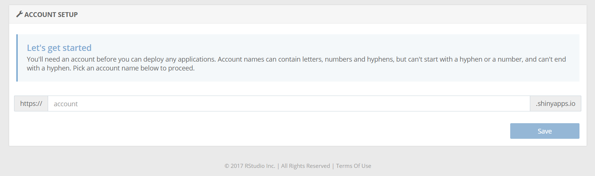

```{r setup, include = FALSE}
knitr::opts_chunk$set(
  collapse = TRUE,
  comment = "#>"
)
```

# Worum geht es?
Einführungstext von Thomas Schmid.

# Technischer Leitfaden
## Ziel
Dieser Leitfaden richtet sich an technisch versiertes IT-Personal und erklärt die nötigen Schritte, die unternommen werden müssen, um den OpenSource Vereinbarkeitssimulator im Internet für das eigene Unternehmen online verfügbar zu machen.

## Technische Voraussetzungen 
Der Vereinbarkeitssimulator ist eine in R entwickelte Shiny-Applikation, die von den Benutzern online via Browser genutzt werden kann. Grundsätzlich gibt es die folgenden Möglichkeiten, die Software im Unternehmen zugänglich zu machen:

**a) Installation unter [www.shinyapps.io](www.shinyapps.io):**
Bei dieser Installationsvariante wird nachfolgend genauer beschrieben. Wenn Sie diesen Weg wählen, benötigen Sie keine eigene Hardware, um den Vereinbarkeitssimulator betreiben zu können. Stattdessen eröffnen Sie einen Account unter www.shinyapps.io, unter dem Sie dann die hier angebotene Software installieren und betreiben. Die Kosten für einen Account sind abhängig von der *aktiven Zeit* pro Monat, d.h. die Zeitdauer, während der die Anwendung von Ihren Anwendern genutzt wird. Details zum Pricing finden Sie [hier](https://www.shinyapps.io/#pricing). 

**b) Installation auf dem eigenen Shiny-Server:**
Bei dieser Variante benötigen Sie Zugang zu einem Linux-Server mit Administrator-Rechten, auf dem Sie für Ihr Unternehmen einen Shiny-Server installieren und die darauf verwaltete Webapplikation im Intranet für Ihr Unternehmen verfügbar machen können. Diese Variante erfordert weiterführende Kenntnisse im Linux-, Server- und Netzwerk-Administrationsumfeld und wird hier nicht weiter behandelt. Informationen zum Download finden Sie [hier](https://www.rstudio.com/products/shiny/download-server/).

Unabhängig von der Variante der gewählten Installation benötigen Sie einen PC mit Internetverbindung, auf dem Sie R-Studio installieren können und auf dem Sie berechtigt sind, Software zu installieren. Im Folgenden werden die nötigen Schritte zur Installation nach Variante a) erläutert.

## Vorbereitungen

### Erstellung eines Accounts unter shinyapp.io
Wie erwähnt handelt es sich beim Vereinbarkeitssimulator um eine in R / Shiny entwickelte Webapplikation. Die Plattform [https://www.shinyapps.io/](https://www.shinyapps.io/) bietet Ihnen die Möglichkeit, Shiny-Applikationen online über eine z.T. wählbare URL verfügbar zu machen. Sie benötigen also hier zu erst einen Account, damit Sie danach hier den Simulator installieren können. I.d.R. sieht die Domain wie folgt aus:

https://accountname.shinyapps.io/{applicationName}

Sowohl der Accountname als auch der Application-Name kann von Ihnen gewählt werden, wobei der Accountname natürlich eindeutig sein muss und nicht bereits vergeben sein darf. Nach der Wahl von Login, Passwort und E-Mail-Adresse kann der Accountname definiert werden:

<center>
{width=100%}
</center>


### Installation benötigter Software auf Ihrem PC
Damit Sie den Vereinbarkeitssimulator 

Um den Vereinbarkeitssimulator für Ihr Unternehmen veröffentlichen zu können, müssen die Nutzer über einen Internet-Zugang verfügen


- Browser: Chrome, Firefox, Safari, Opera, 
-
